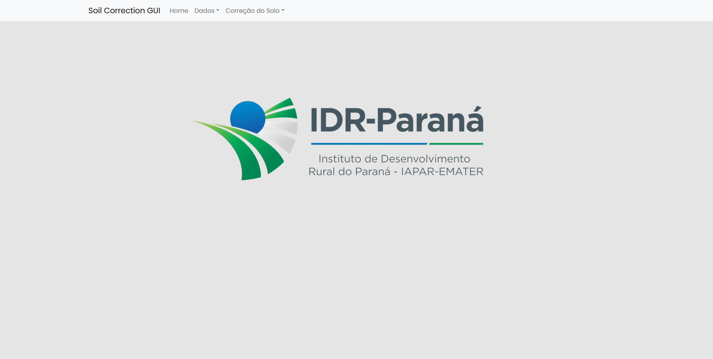
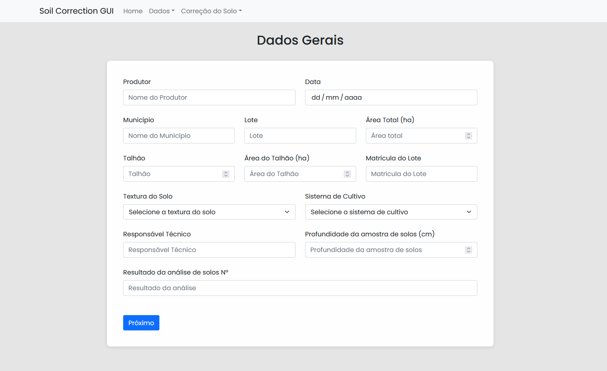
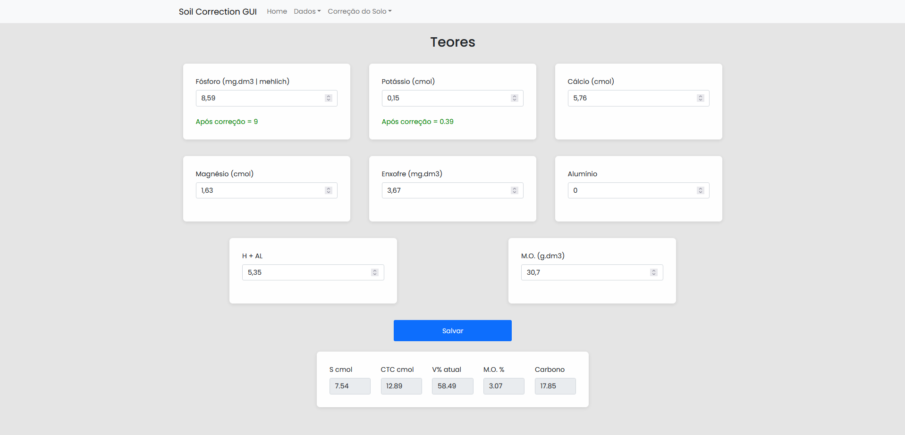
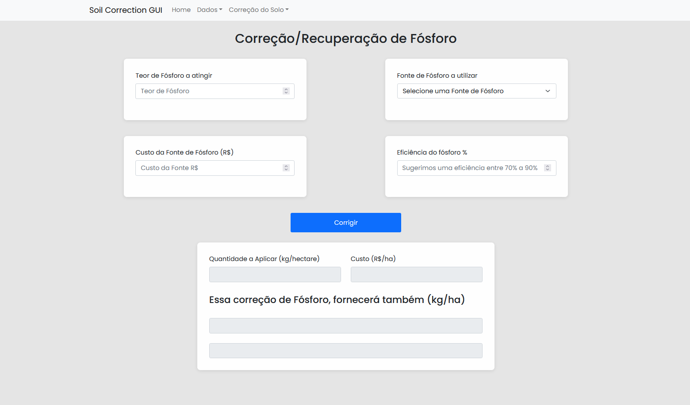
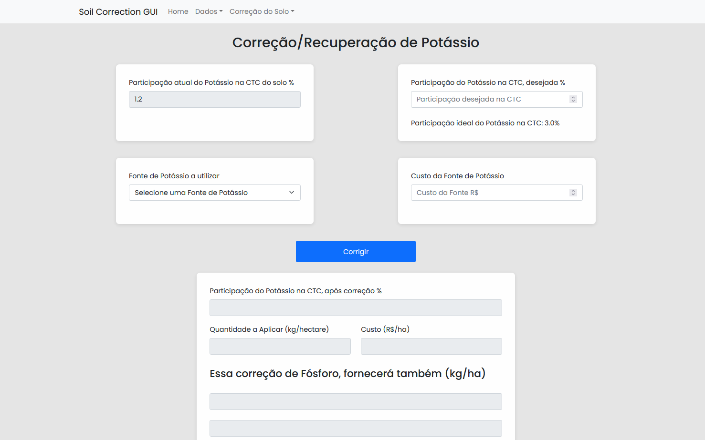
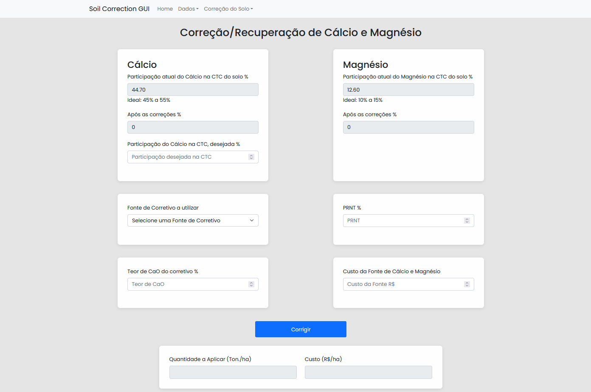

# Soil Correction

Esse projeto tem o intuito de integrar o [Front-End](https://github.com/raulval/sa-soilcorrection-gui) com o Back-End, que tem como base o repositório [Soil Correction](https://github.com/raulval/sa-soilcorrection) da disciplina de Arquitetura de Software UTFPR-CP. 
O motivo para usar a arquitetura cliente-servidor foi a flexibilidade, a manutenabilidade e a escalabilidade que essa arquitetura traz.

# Estrutura
A arquitetura utilizada na parte de back-end foi a Spring Boot Flow, porém sem o banco de dados. Nessa estrutura o cliente faz uma requisição HTTP do tipo POST, a requisição vai para os controllers onde são mapeadas e então vai para a camada service, na service é onde acontece a parte lógica do projeto. Após isso os resultados são mapeados para a camada models e assim retornado para o usuário se não houver nenhum erro.


# Tecnologias

Para a elaboração do Front-End foi usado o React e o Redux para persistência dos dados. Já para o Back-End foi utilizado o Spring Boot.

# Screenshots

### Tela Home
  <h1 align="center">
    
  </h1>
A tela home conta com a logo do IDR-Paraná em um Header para navegar por todas as páginas do site.

---

### Tela de Dados
  <h1 align="center">
    
  </h1>
  
A tela de dados é onde o usuário irá preencher os campos necessários para fazer os cálculos do restante da aplicação. Clicando no botão próximo ele vai para a tela de Teores.

---

### Tela de Teores
  <h1 align="center">
    
  </h1>

Na tela de Teores é que o usuário coloca os dados necessários para a aplicação funcione corretamente. A escolha da textura do solo na tela de Dados impacta nos valores ideais. Após o usuário preencher todos os campos e clicar em salvar o valor de S cmol, CTC cmol, V% atual, M.O.% e Carbono são calculados e os dados ficam salvos continuando na tela de Teores.

---
### Tela de Correções
  <h1 align="center">
    
    
    
  </h1>

Na tela de correções é onde os cálculos são feitos para chegar nos valores ideais propostos. Cada correção tem seus próprios componentes, sendo em comum a quantidade a aplicar e o custo.

# Iniciando o projeto

Primeiro clone o projeto para seu computador usando os comandos:
```bash
git clone https://github.com/raulval/sa-soilcorrection-app
cd sa-soilcorrection-app
```
### Para o Back-End
```bash
cd backend
```
Após feito isso, instale as dependências com o comando:
```bash
mvn install
```
Para rodar o Back-End:
```bash
mvn spring-boot:run
```
O Back-End estará rodando em [http://localhost:8080](http://localhost:8080)

### Para o Front-End
```bash
cd frontend
```

Após feito isso adicione as dependências usando o comando:
```bash
npm install 
#ou 
yarn add
```

Após isso é só iniciar o projeto usando o comando:
```bash
npm start 
#ou 
yarn start
```

A aplicação irá rodar em modo de desenvolvimento.\
Abra [http://localhost:3000](http://localhost:3000) para ver no navegador.

A página irá atualizar após salvar o projeto.

